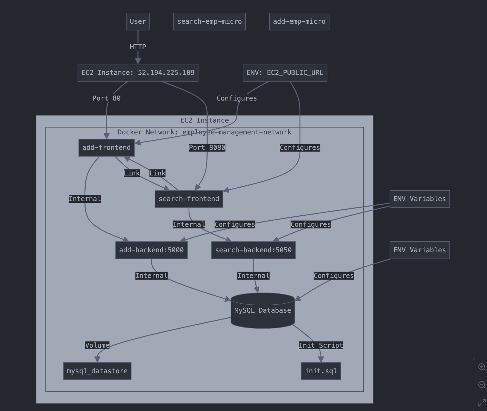
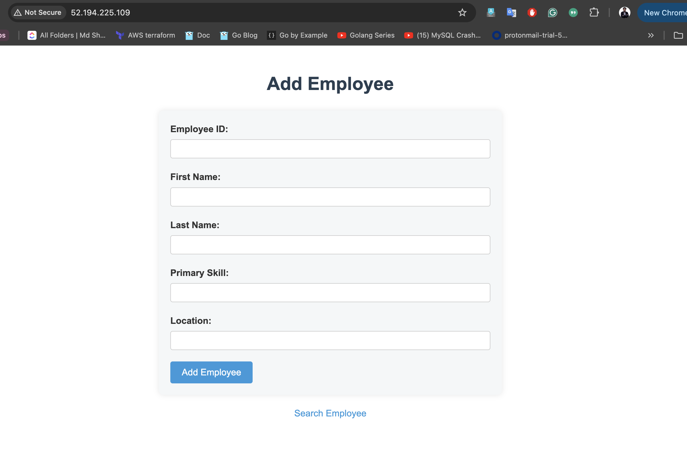
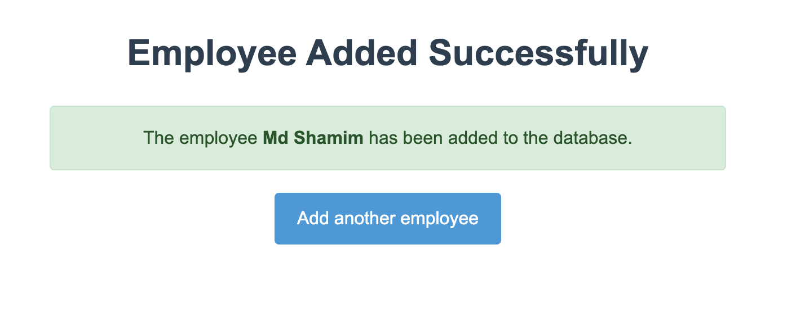
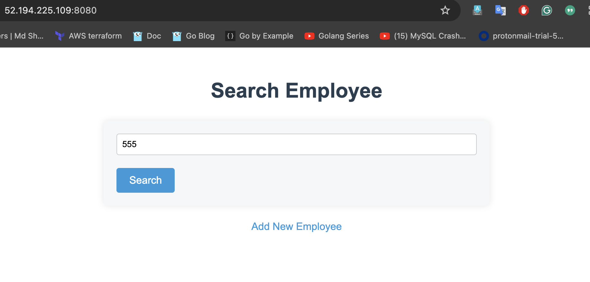
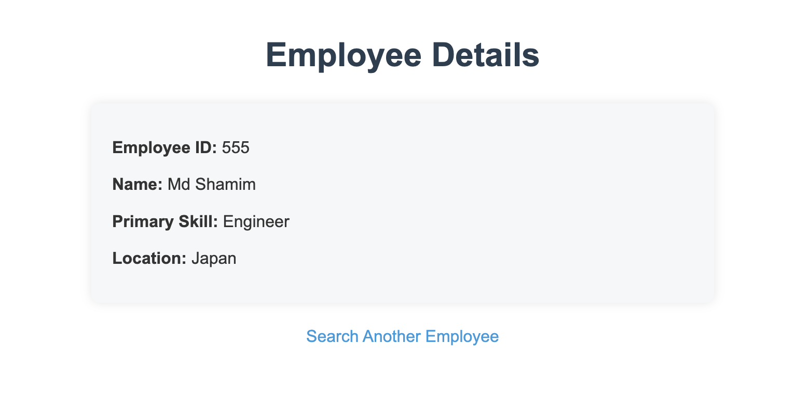

# Employee Management System

## Overview

This Employee Management System is a microservices-based application designed to manage employee data. It consists of two main components:

1. Add Employee Service (add-emp-micro)
2. Search Employee Service (search-emp-micro)

The system is containerized using Docker and orchestrated with Docker Compose, making it easy to deploy and manage.

## System Architecture




## Prerequisites

- Amazon EC2 instance (Amazon Linux 2 or Ubuntu Server 20.04 LTS recommended)
- Docker and Docker Compose installed on the EC2 instance
- Git for cloning the repository
- EC2 security group configured to allow inbound traffic on ports 80 (HTTP), and 8080 (Custom TCP)

## Installation

<!-- 1. Connect to your EC2 instance:
   ```
   ssh -i your-key.pem ec2-user@your-ec2-public-dns
   ``` -->

1. Install Docker and Docker Compose:
   ```bash
   # For Amazon Linux 2
   sudo yum update -y
   sudo amazon-linux-extras install docker
   sudo service docker start
   sudo usermod -a -G docker ec2-user
   sudo chkconfig docker on

   # For Ubuntu
   sudo apt update
   sudo apt install -y docker.io

   # Install Docker Compose
   sudo curl -L "https://github.com/docker/compose/releases/download/1.29.2/docker-compose-$(uname -s)-$(uname -m)" -o /usr/local/bin/docker-compose
   sudo chmod +x /usr/local/bin/docker-compose
   ```

2. Log out and log back in to apply the docker group changes.

3. Clone the repository:
   ```
   git clone https://your-repository-url.git
   cd your-repository-name
   ```

6. Deploy the add-emp-micro service:
   ```
   cd add-emp-micro
   ```
   - Change ` EC2_PUBLIC_URL=<ip or dns>` in `docker-compose.y
   ```
   docker-compose up -d
   ```

7. Deploy the search-emp-micro service:
   ```
   cd ../search-emp-micro
   ```
   - Change ` EC2_PUBLIC_URL=<ip or dns>` in `docker-compose.yml`
   ```
   docker-compose up -d
   ```

8. Verify that all services are running:
   ```
   docker-compose ps
   ```

## Usage

- To add an employee, access: `http://your-ec2-public-ip-or-dns`

- After adding:

- To search for an employee, access: `http://your-ec2-public-ip-or-dns:8080`

- After search:

Replace `your-ec2-public-ip-or-dns` with your actual EC2 instance's public IP or DNS.

## Troubleshooting

If you encounter any issues:

1. Check the logs of the service:
   ```
   docker-compose logs service-name
   ```

2. Ensure the database is properly initialized:
   ```
   docker-compose exec db mysql -uroot -pabcd1234 -e "USE employee_db; SHOW TABLES;"
   ```

3. If needed, rebuild a service:
   ```
   docker-compose up -d --build service-name
   ```

## Updating the Application

1. Pull the latest changes:
   ```
   git pull origin main
   ```

2. Rebuild and restart the services:
   ```
   docker-compose down
   docker-compose up -d --build
   ```

## Backup and Restore

- To backup the database:
  ```
  docker-compose exec db mysqldump -u root -pabcd1234 employee_db > backup.sql
  ```

- To restore the database:
  ```
  cat backup.sql | docker exec -i container-name mysql -u root -pabcd1234 employee_db
  ```
